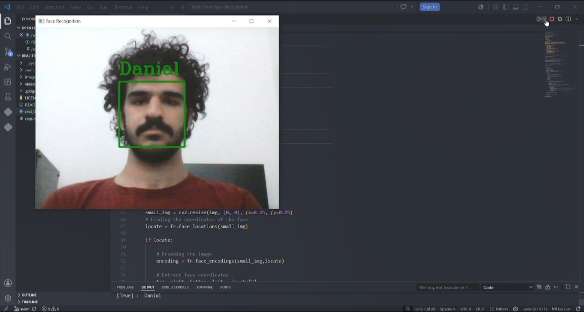

# Real-Time Face Recognition

A real-time face recognition system built with **Python**, **OpenCV**, and the **face_recognition** library.

## Overview

This project detects a face from a live webcam stream, generates its facial encoding, compares it with a pre-encoded known face, and displays the recognized person's name in real time.

## Screenshot



## Demo

A short demonstration of the project is available below.

🎥 [Watch Demo Video](videos/demo.mp4)

## Features

- 📷 Real-time webcam capture
- 👤 Face detection
- 🧠 Face encoding
- 🔍 Face comparison
- 🏷️ Automatic name labeling
- 🟦 Bounding box visualization
- ⚡ Lightweight and easy to understand implementation

## Technologies

- Python 3
- OpenCV
- face_recognition
- dlib

## Project Structure

```
Real-Time-Face-Recognition/
│
├── real_time_face_recognition.py           # Main application
├── README.md                               # Project documentation
├── requirements.txt                        # Project dependencies
├── LICENSE                                 # MIT License
├── .gitignore                              # Git ignored files
│
├── images/                                 # Pictures
|   └──Screenshot.jpg
|   └──test_image.jpg                                 
|__ videos/
└   └──demo.mp4                             # Demo videos
```

## Installation

Clone the repository:

```bash
git clone https://github.com/danibrj/Real-Time-Face-Recognition.git
```

Go to the project directory:

```bash
cd Real-Time-Face-Recognition
```

Install the required packages:

```bash
pip install -r requirements.txt
```

## Usage

1. Place the reference image in the project directory.
2. Update the image path in `real_time_face_recognition.py` if needed.
3. Run the application:

```bash
python real_time_face_recognition.py
```

4. The webcam will open automatically.
5. If a known face is detected, the person's name will be displayed above the face.

## Future Improvements

- [ ] Support multiple face recognition
- [ ] Display confidence score
- [ ] Improve FPS and performance
- [ ] Use face distance for more accurate matching
- [ ] Better project architecture

> **Project Status:** Version 1.0 ✅
>
> This project will be continuously improved with additional features and performance optimizations.

## Author

**Danial Barjasteh**

- Computer Engineering Student
- University: (K. N. Toosi University of Technology)
- GitHub: https://github.com/danibrj
- LinkedIn: https://www.linkedin.com/in/danial-barjasteh-a507b6348/
